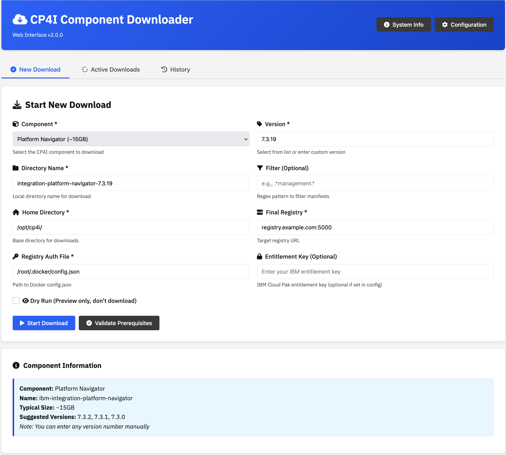
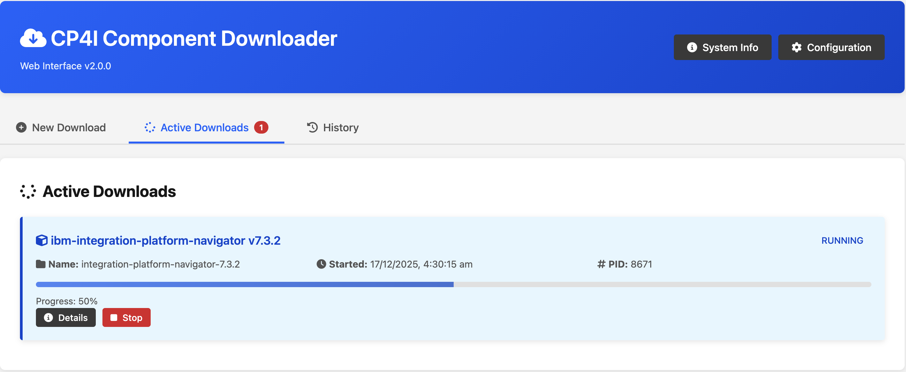
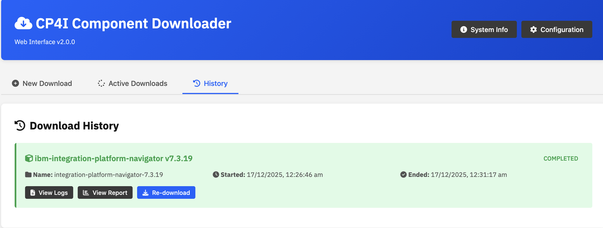
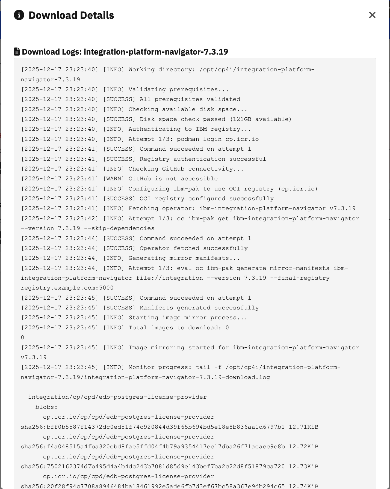
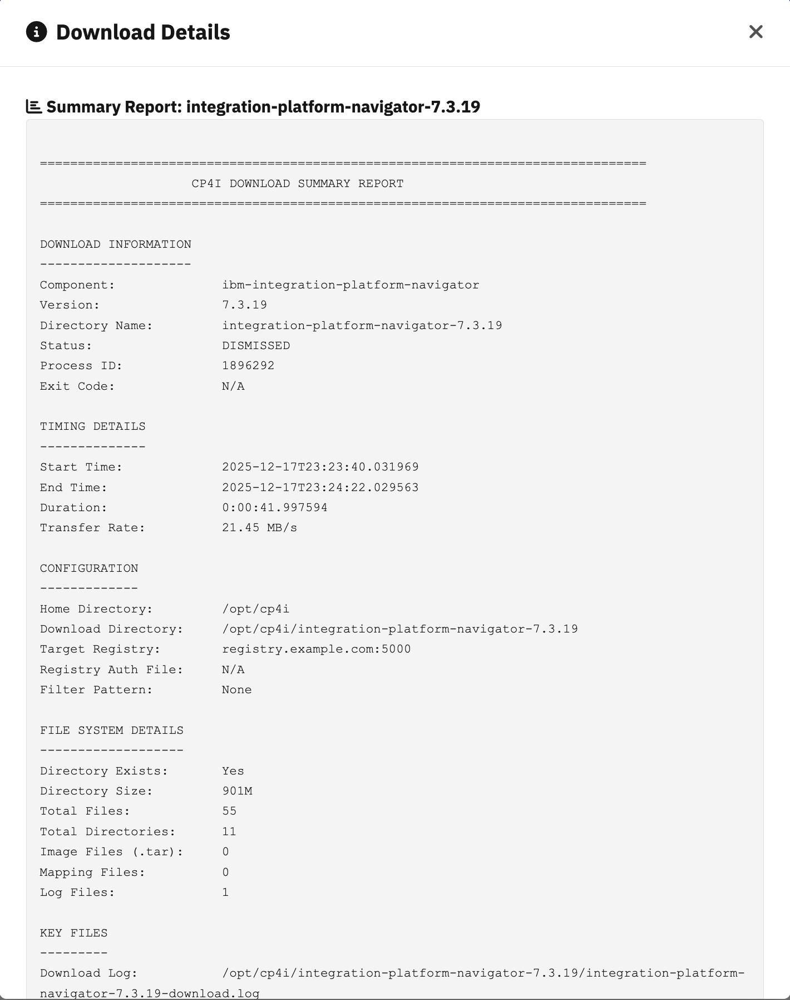

# CP4I Component Downloader

A comprehensive, enterprise-grade solution for downloading IBM Cloud Pak for Integration (CP4I) components with both **Web UI** and **CLI** interfaces. Features include automatic GitHub fallback, retry logic, progress tracking, and notification support.

## 🖼️ UI Screenshots

### Web Interface Overview

<div align="center">

#### New Download Form

*User-friendly form for configuring and starting new downloads*

#### Active Downloads

*Real-time monitoring of running downloads with progress tracking*

#### Download History

*Complete history with status, logs, and reports*

#### View Logs

*Detailed log viewer with real-time updates*

#### Summary Report

*Comprehensive download statistics and information*

</div>

> **Note:** To add screenshots, place your images in the `screenshots/` directory with the following names:
> - `new-download.png` - New download form
> - `active-downloads.png` - Active downloads tab
> - `history.png` - History tab
> - `view-logs.png` - Log viewer modal
> - `summary-report.png` - Summary report modal

## 📋 Table of Contents

- [UI Screenshots](#ui-screenshots)
- [Features](#features)
- [Prerequisites](#prerequisites)
- [Installation](#installation)
- [Configuration](#configuration)
- [Usage](#usage)
- [Examples](#examples)
- [Troubleshooting](#troubleshooting)
- [Advanced Features](#advanced-features)
- [FAQ](#faq)

## ✨ Features

### Core Capabilities
- ✅ **Automatic GitHub/OCI Registry Detection** - Seamlessly switches to OCI registry when GitHub is unavailable
- ✅ **Prerequisite Validation** - Checks all required tools before execution
- ✅ **Disk Space Verification** - Ensures sufficient storage before download
- ✅ **Retry Logic** - Exponential backoff for failed operations
- ✅ **Progress Tracking** - Real-time monitoring of download progress
- ✅ **Resume Support** - Continue interrupted downloads
- ✅ **Notification System** - Webhook and email alerts
- ✅ **Comprehensive Logging** - Multi-level logging with detailed reports
- ✅ **Configuration File Support** - Centralized configuration management
- ✅ **Dry Run Mode** - Test operations without execution

### Enterprise Features
- 🔒 Secure credential handling via environment variables
- 📊 Detailed summary reports with statistics
- 🔄 Configurable parallel downloads
- 📝 Failed image tracking for easy retry
- ⚡ Performance optimizations
- 🎯 Manifest filtering support

## 🔧 Prerequisites

### Required Tools

The script automatically validates these prerequisites:

| Tool | Purpose | Installation |
|------|---------|--------------|
| `oc` | OpenShift CLI | [Download](https://docs.openshift.com/container-platform/latest/cli_reference/openshift_cli/getting-started-cli.html) |
| `oc ibm-pak` | IBM Pak plugin | [GitHub](https://github.com/IBM/ibm-pak) |
| `podman` | Container management | [Install Guide](https://podman.io/getting-started/installation) |
| `curl` | HTTP requests | `yum install curl` or `apt install curl` |
| `jq` | JSON processing | `yum install jq` or `apt install jq` |
| `timeout` | Command timeout | Usually included in `coreutils` |

### System Requirements

- **Disk Space**: Minimum 100GB free space (configurable)
- **Memory**: 4GB RAM recommended
- **Network**: Access to `cp.icr.io` registry
- **OS**: Linux (RHEL, CentOS, Ubuntu, etc.)

### Optional Requirements

- `mail` or `sendmail` - For email notifications
- IBM Entitlement Key - For automated authentication

## 📥 Installation

### 1. Download the Script

```bash
# Clone or download the script
curl -O https://your-repo/cp4i_downloader.sh
chmod +x cp4i_downloader.sh
```

### 2. Install Prerequisites

**RHEL/CentOS:**
```bash
# Install required packages
sudo yum install -y curl jq coreutils

# Install Podman
sudo yum install -y podman

# Install OpenShift CLI
curl -LO https://mirror.openshift.com/pub/openshift-v4/clients/ocp/latest/openshift-client-linux.tar.gz
tar xvf openshift-client-linux.tar.gz
sudo mv oc /usr/local/bin/

# Install oc ibm-pak plugin
curl -LO https://github.com/IBM/ibm-pak/releases/latest/download/oc-ibm_pak-linux-amd64.tar.gz
tar xvf oc-ibm_pak-linux-amd64.tar.gz
sudo mv oc-ibm_pak-linux-amd64 /usr/local/bin/oc-ibm_pak
```

**Ubuntu/Debian:**
```bash
# Install required packages
sudo apt update
sudo apt install -y curl jq coreutils

# Install Podman
sudo apt install -y podman

# Install OpenShift CLI (same as above)
# Install oc ibm-pak plugin (same as above)
```

### 3. Verify Installation

```bash
./cp4i_downloader.sh --help
```

## ⚙️ Configuration

### Method 1: Configuration File (Recommended)

Create a configuration file for persistent settings:

```bash
# Generate sample configuration
./cp4i_downloader.sh --create-config
```

This creates `/opt/cp4i/.cp4i-downloader.conf`:

```bash
# CP4I Downloader Configuration File

# IBM Entitlement Key (get from https://myibm.ibm.com/products-services/containerlibrary)
CP4I_ENTITLEMENT_KEY="your_entitlement_key_here"

# Notification Settings
CP4I_WEBHOOK_URL="https://your-webhook-url.com/notify"
CP4I_NOTIFICATION_EMAIL="admin@example.com"

# Performance Settings
MAX_PARALLEL_DOWNLOADS=2

# Disk Space Requirements (GB)
MIN_DISK_SPACE_GB=100

# Retry Settings
MAX_RETRIES=3
RETRY_BASE_DELAY=5
```

### Method 2: Environment Variables

```bash
# Set environment variables
export CP4I_ENTITLEMENT_KEY="your_key_here"
export CP4I_WEBHOOK_URL="https://webhook.site/your-unique-url"
export CP4I_NOTIFICATION_EMAIL="admin@example.com"

# Run the script
./cp4i_downloader.sh --component ibm-mq --version 9.3.5 --name mq-9.3.5
```

### Method 3: Interactive Authentication

If no entitlement key is provided, the script will prompt for credentials:

```bash
./cp4i_downloader.sh --component ibm-mq --version 9.3.5 --name mq-9.3.5
# Will prompt: Username: cp
# Will prompt: Password: [enter your entitlement key]
```

## 🚀 Usage

### Basic Syntax

```bash
./cp4i_downloader.sh --component <COMPONENT> --version <VERSION> --name <NAME> [OPTIONS]
```

### Required Parameters

| Parameter | Description | Example |
|-----------|-------------|---------|
| `--component` | IBM operator component name | `ibm-integration-platform-navigator` |
| `--version` | Component version | `7.3.2` |
| `--name` | Local directory name | `pn-7.3.2` |

### Optional Parameters

| Parameter | Description | Default |
|-----------|-------------|---------|
| `--filter` | Manifest filter pattern | None |
| `--dry-run` | Show actions without executing | `false` |
| `--retry` | Resume previous download | `false` |
| `--force-retry` | Force retry from mapping file | `false` |
| `--verbose` | Enable debug logging | `false` |
| `--create-config` | Create sample config file | N/A |
| `--help` | Show help message | N/A |

## 📚 Examples

### Example 1: Basic Download

Download IBM Integration Platform Navigator:

```bash
./cp4i_downloader.sh \
  --component ibm-integration-platform-navigator \
  --version 7.3.2 \
  --name pn-7.3.2
```

### Example 2: Download with Filter

Download only management components of API Connect:

```bash
./cp4i_downloader.sh \
  --component ibm-apiconnect \
  --version 10.0.8 \
  --name apic-10.0.8 \
  --filter ".*management.*"
```

### Example 3: Dry Run

Test the download without actually executing:

```bash
./cp4i_downloader.sh \
  --component ibm-mq \
  --version 9.3.5 \
  --name mq-9.3.5 \
  --dry-run
```

### Example 4: Verbose Logging

Enable detailed debug output:

```bash
./cp4i_downloader.sh \
  --component ibm-eventstreams \
  --version 11.4.0 \
  --name es-11.4.0 \
  --verbose
```

### Example 5: Resume Failed Download

Continue an interrupted download:

```bash
./cp4i_downloader.sh \
  --component ibm-app-connect \
  --version 12.0.11 \
  --name ace-12.0.11 \
  --retry
```

### Example 6: Force Retry

Force retry from the mapping file:

```bash
./cp4i_downloader.sh \
  --component ibm-datapower-operator \
  --version 1.11.0 \
  --name dp-1.11.0 \
  --force-retry
```

## 🔍 Monitoring Progress

### Real-time Log Monitoring

```bash
# Monitor the download log
tail -f /opt/cp4i/<NAME>/<NAME>-download.log

# Example
tail -f /opt/cp4i/pn-7.3.2/pn-7.3.2-download.log
```

### Check Summary Report

```bash
# View the summary report
cat /opt/cp4i/<NAME>/<NAME>-summary-report.txt

# Example
cat /opt/cp4i/pn-7.3.2/pn-7.3.2-summary-report.txt
```

### Sample Summary Report

```
========================================
CP4I Download Summary Report
========================================
Status: IN_PROGRESS
Component: ibm-integration-platform-navigator
Version: 7.3.2
Start Time: 2025-12-16 10:30:00
End Time: 2025-12-16 12:45:30
Duration: 2h 15m 30s
Total Images: 45
Successful: 45
Failed: 0
========================================

Working Directory: /opt/cp4i/pn-7.3.2
Mapping File: /opt/cp4i/.ibm-pak/data/mirror/ibm-integration-platform-navigator/7.3.2/images-mapping-to-filesystem.txt
Log File: /opt/cp4i/pn-7.3.2/pn-7.3.2-download.log

========================================
Generated by CP4I Downloader v2.0.0
========================================
```

## 🛠️ Troubleshooting

### Common Issues

#### 1. GitHub Access Denied

**Problem**: Script cannot access GitHub

**Solution**: The script automatically detects this and switches to OCI registry. No action needed.

```bash
[2025-12-16 10:30:00] [WARN] GitHub is not accessible
[2025-12-16 10:30:01] [INFO] Configuring ibm-pak to use OCI registry (cp.icr.io)
```

#### 2. Insufficient Disk Space

**Problem**: Not enough disk space

**Solution**: Free up space or change the working directory

```bash
# Check available space
df -h /opt/cp4i

# Clean up old downloads
rm -rf /opt/cp4i/old-component-*
```

#### 3. Authentication Failed

**Problem**: Registry authentication fails

**Solution**: Verify your entitlement key

```bash
# Test authentication manually
podman login cp.icr.io -u cp -p "YOUR_ENTITLEMENT_KEY"

# Get a new key from
# https://myibm.ibm.com/products-services/containerlibrary
```

#### 4. Download Interrupted

**Problem**: Download stopped unexpectedly

**Solution**: Use the retry option

```bash
./cp4i_downloader.sh \
  --component <COMPONENT> \
  --version <VERSION> \
  --name <NAME> \
  --retry
```

#### 5. Missing Prerequisites

**Problem**: Required tools not installed

**Solution**: Install missing tools

```bash
# The script will tell you what's missing
[2025-12-16 10:30:00] [ERROR] Missing required commands: jq curl

# Install them
sudo yum install -y jq curl
```

### Debug Mode

Enable verbose logging for detailed troubleshooting:

```bash
./cp4i_downloader.sh \
  --component <COMPONENT> \
  --version <VERSION> \
  --name <NAME> \
  --verbose
```

### Log Files Location

All logs are stored in the working directory:

```
/opt/cp4i/<NAME>/
├── <NAME>-download.log          # Main download log
├── <NAME>-summary-report.txt    # Summary report
└── .progress_monitor.pid        # Progress monitor PID
```

## 🎯 Advanced Features

### 1. Webhook Notifications

Configure webhook for real-time notifications:

```bash
export CP4I_WEBHOOK_URL="https://webhook.site/your-unique-url"
```

The script sends JSON payloads:

```json
{
  "status": "STARTED",
  "component": "ibm-integration-platform-navigator",
  "version": "7.3.2",
  "message": "Download started for ibm-integration-platform-navigator v7.3.2",
  "timestamp": "2025-12-16 10:30:00"
}
```

### 2. Email Notifications

Configure email alerts:

```bash
export CP4I_NOTIFICATION_EMAIL="admin@example.com"
```

Requires `mail` or `sendmail` to be installed.

### 3. Custom Retry Configuration

Adjust retry behavior in config file:

```bash
# Maximum retry attempts
MAX_RETRIES=5

# Initial delay between retries (seconds)
RETRY_BASE_DELAY=10
```

The script uses exponential backoff: 10s, 20s, 40s, 80s, 160s

### 4. Performance Tuning

Increase parallel downloads:

```bash
# In config file
MAX_PARALLEL_DOWNLOADS=4

# Or modify the script directly
readonly MAX_PARALLEL_DOWNLOADS=4
```

**Note**: Higher values may cause network issues. Test carefully.

### 5. Manifest Filtering

Download specific components using filters:

```bash
# Only management components
--filter ".*management.*"

# Only gateway components
--filter ".*gateway.*"

# Multiple patterns (regex)
--filter ".*management.*|.*analytics.*"
```

## 📊 Component Reference

### Common CP4I Components

| Component | Description | Typical Size |
|-----------|-------------|--------------|
| `ibm-integration-platform-navigator` | Platform Navigator | ~15GB |
| `ibm-apiconnect` | API Connect | ~25GB |
| `ibm-mq` | MQ Advanced | ~8GB |
| `ibm-eventstreams` | Event Streams | ~12GB |
| `ibm-app-connect` | App Connect Enterprise | ~10GB |
| `ibm-datapower-operator` | DataPower Gateway | ~5GB |
| `ibm-aspera-hsts-operator` | Aspera HSTS | ~3GB |
| `ibm-cloud-databases-redis` | Redis | ~2GB |

### Version Compatibility

Check IBM documentation for version compatibility:
- [CP4I Documentation](https://www.ibm.com/docs/en/cloud-paks/cp-integration)
- [Operator Compatibility Matrix](https://www.ibm.com/docs/en/cloud-paks/cp-integration/latest?topic=installing-operator-channel-versions-this-release)

## ❓ FAQ

### Q1: How do I get an IBM Entitlement Key?

**A**: Visit [IBM Container Library](https://myibm.ibm.com/products-services/containerlibrary) and copy your entitlement key.

### Q2: Can I download multiple components at once?

**A**: Currently, the script handles one component at a time. Run multiple instances with different `--name` values for parallel downloads.

### Q3: How much disk space do I need?

**A**: Minimum 100GB, but requirements vary by component. Check the Component Reference table above.

### Q4: What happens if the download fails?

**A**: Use `--retry` to resume from where it stopped. The script tracks progress and can continue interrupted downloads.

### Q5: Can I use this in an air-gapped environment?

**A**: Yes! The script downloads to a local filesystem. You can then transfer the files to your air-gapped environment.

### Q6: How do I verify the download completed successfully?

**A**: Check the summary report:
```bash
cat /opt/cp4i/<NAME>/<NAME>-summary-report.txt
```

### Q7: Can I customize the working directory?

**A**: Yes, modify the `HOME_DIR` variable in the script:
```bash
readonly HOME_DIR="/your/custom/path"
```

### Q8: Does this work with proxy servers?

**A**: Yes, set standard proxy environment variables:
```bash
export HTTP_PROXY="http://proxy.example.com:8080"
export HTTPS_PROXY="http://proxy.example.com:8080"
export NO_PROXY="localhost,127.0.0.1"
```

### Q9: How do I update the script?

**A**: Download the latest version and replace the existing file. Your configuration file will be preserved.

### Q10: Where can I get help?

**A**: 
- Check the [IBM Documentation](https://www.ibm.com/docs/en/cloud-paks/cp-integration)
- Review the troubleshooting section above
- Check the log files for detailed error messages

## 📝 Best Practices

1. **Always use configuration file** for production environments
2. **Enable notifications** for long-running downloads
3. **Monitor disk space** regularly during downloads
4. **Use filters** to download only required components
5. **Test with --dry-run** before actual downloads
6. **Keep logs** for audit and troubleshooting
7. **Use retry** instead of restarting from scratch
8. **Verify checksums** after download (if available)
9. **Document** your component versions and configurations
10. **Regular backups** of downloaded components

## 🔐 Security Considerations

- Never commit entitlement keys to version control
- Use environment variables or config files for credentials
- Restrict access to the working directory (`chmod 700`)
- Regularly rotate entitlement keys
- Monitor access logs for unauthorized attempts
- Use secure channels (HTTPS) for webhooks
- Validate downloaded images before deployment

## 📄 License

This script is provided as-is for use with IBM Cloud Pak for Integration. Refer to IBM's licensing terms for the actual software components.

## 🤝 Contributing

Suggestions and improvements are welcome! Please ensure:
- Code follows bash best practices
- Changes are backward compatible
- Documentation is updated
- Testing is performed

## 📞 Support

For issues related to:
- **Script functionality**: Check troubleshooting section
- **IBM products**: Contact IBM Support
- **Prerequisites**: Refer to official documentation

## 🔄 Version History

### v2.0.0 (Current)
- ✅ GitHub/OCI registry auto-detection
- ✅ Comprehensive error handling
- ✅ Progress tracking and notifications
- ✅ Configuration file support
- ✅ Enhanced logging and reporting

### v1.0.0 (Legacy)
- Basic download functionality
- Manual GitHub dependency

---

**Script Version**: 2.0.0  
**Last Updated**: December 2025  
**Maintained by**: DevOps Team

For the latest version and updates, check the repository.